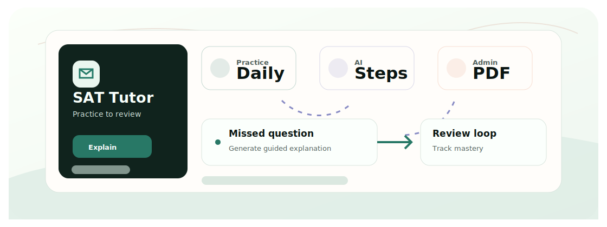
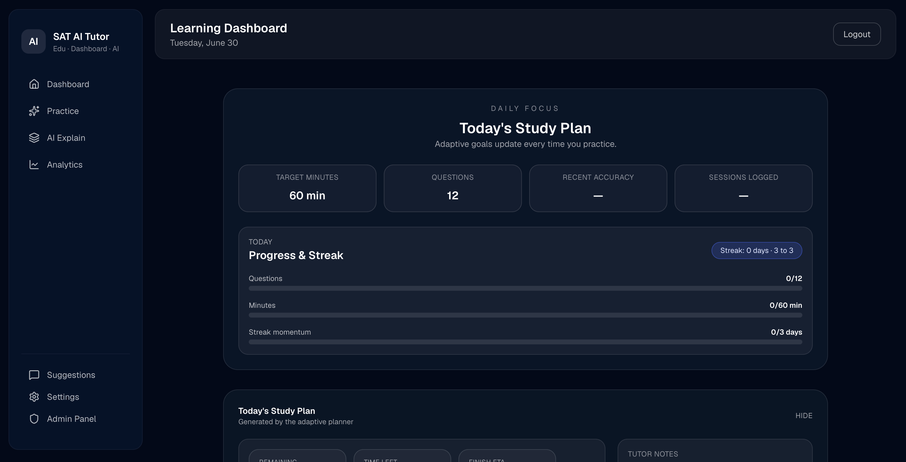

<div align="center">
  <h1>SAT AI Tutor</h1>
  <p>A full-stack SAT practice platform with adaptive study plans, AI explanations, PDF import, analytics, and admin tools.</p>

  <p>
    <a href="README.zh-CN.md">Chinese</a>
    &middot;
    <a href="#quickstart">Quickstart</a>
    &middot;
    <a href="#tech-stack">Tech Stack</a>
  </p>

  <p>
    
    
    
    
  </p>
</div>

<p align="center">
  
</p>

<p align="center">
  
</p>

## Why This Exists

Students need more than an answer key after missing a question. This platform turns practice attempts into guided review: visual explanations, mastery tracking, adaptive planning, and admin-managed SAT-style content.

## Workflow

- Students complete SAT-style practice sessions.
- The backend tracks mastery, session history, and review timing.
- AI explanations are generated as structured steps with highlights and notes.
- Admins import and review question content from PDFs.
- Analytics and plans guide the next practice session.

## Features

- Student dashboard, practice sessions, review history, analytics, and study plans.
- Structured AI explanations with visual highlights, board notes, math rendering, and bilingual output.
- PDF ingestion and admin review workflow for SAT-style questions.
- Backend tests, migrations, metrics, memberships, and support flows.

## Quickstart

```bash
git clone https://github.com/Ha22yX/SAT-AI-Tutor.git
cd SAT-AI-Tutor/sat_platform
python -m venv .venv
.venv\Scripts\activate
pip install -r requirements.txt
python app.py

cd ../frontend
npm install
npm run dev
```

Configure backend `.env` values before using OpenAI, email, or production database features.

## Tech Stack

| Layer | Technology | Role |
| --- | --- | --- |
| Frontend | Next.js, React, TypeScript, Tailwind | Student/admin UI and explanation viewer. |
| Backend | Flask, SQLAlchemy, Alembic | API, auth, learning data, and migrations. |
| AI | OpenAI-compatible API | Explanations, import assistance, and review content. |
| Content | pdfplumber, python-docx, unstructured | Question import and document parsing. |

## Project Map

```text
frontend/                 Next.js student/admin UI
sat_platform/             Flask backend, models, services, migrations, tests
docs/images/              README dashboard screenshot
Others/                   planning notes, scripts, SAT PDF samples
pytest.ini                backend test configuration
```

## Notes

This is one of the larger full-stack projects in the portfolio. Deeper implementation plans live under `Others/` and `docs/`.
