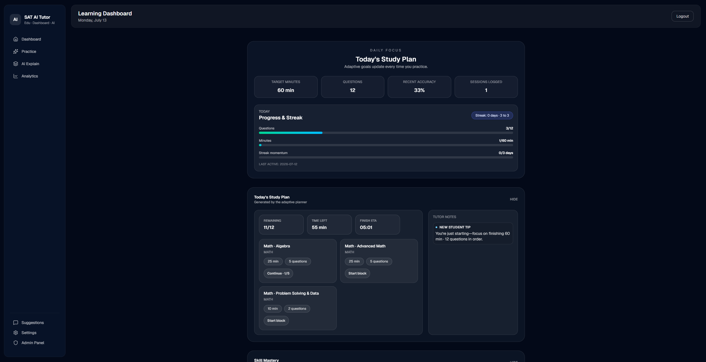
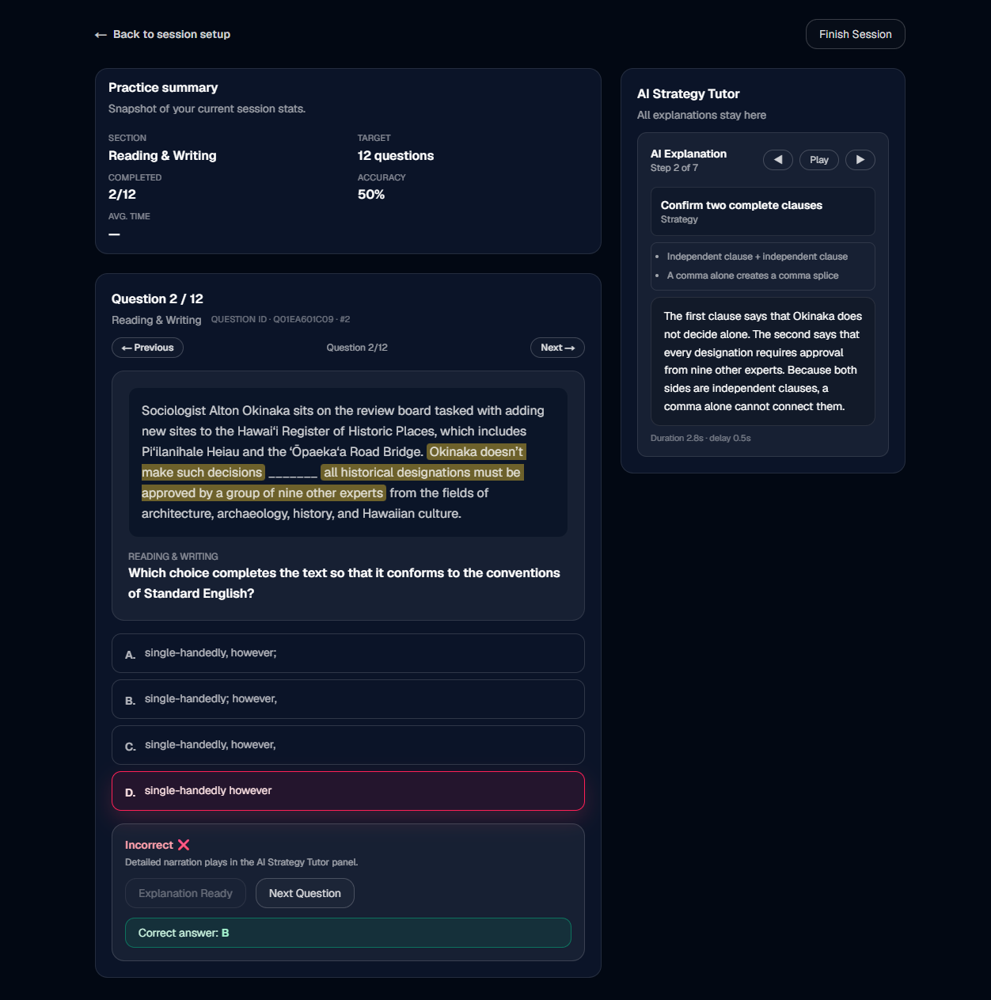
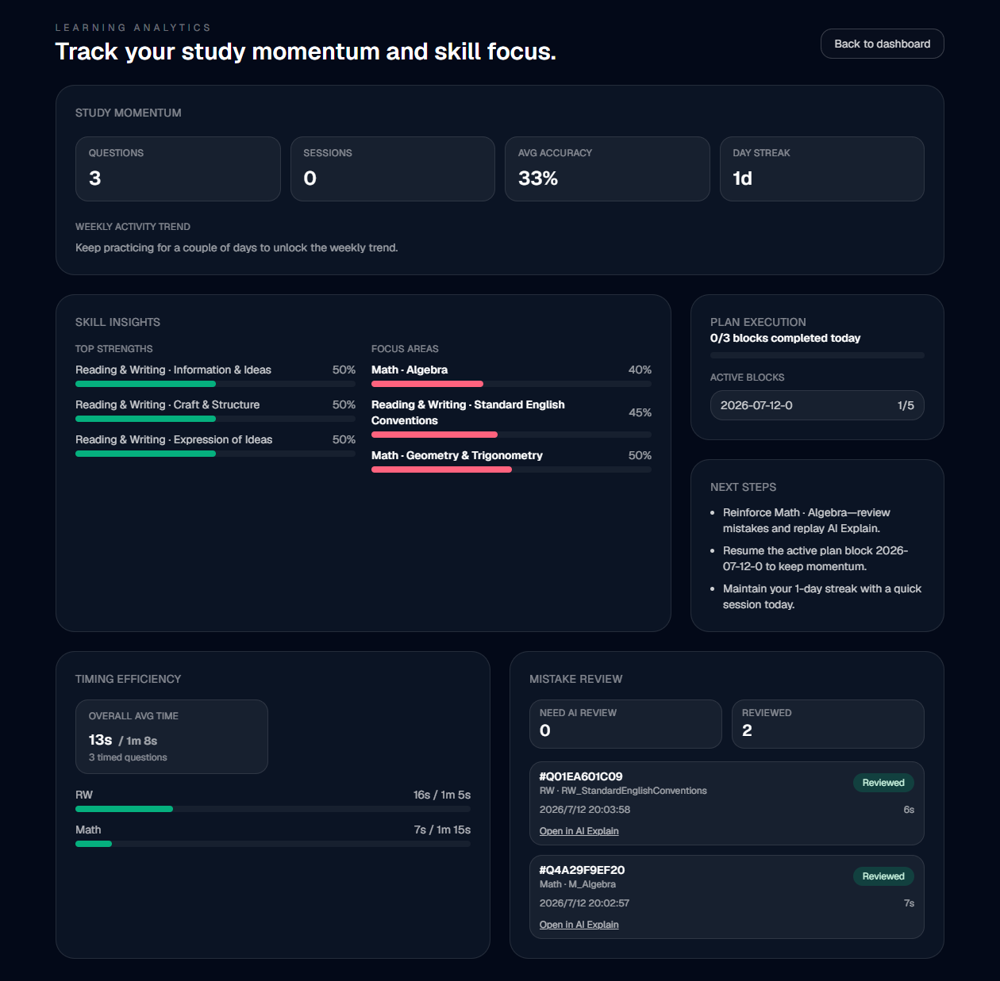

<div align="center">
  <h1>SAT AI Tutor</h1>
  <p>A full-stack SAT practice platform with adaptive study plans, AI explanations, PDF import, analytics, and admin tools.</p>

  <p>
    <a href="README.zh-CN.md">Chinese</a>
    &middot;
    <a href="#quickstart">Quickstart</a>
    &middot;
    <a href="#docker--ghcr">Docker</a>
    &middot;
    <a href="#features">Features</a>
  </p>

  <p>
    
    
    
    <a href="https://github.com/Ha22yX/SAT-AI-Tutor/pkgs/container/sat-ai-tutor"></a>
    
  </p>
</div>

## Product Screenshots

### Student Dashboard

The main dashboard gives students a quick view of their daily study plan, progress, mastery trends, and recommended next actions.

<p align="center">
  
</p>

### Practice Interface

The practice screen focuses on one SAT-style question at a time, with answer entry, progress tracking, figures, and review controls kept close to the work area.

<p align="center">
  
</p>

### AI Analysis

The AI analysis view turns each answer into structured feedback, highlighting reasoning steps, explanations, and personalized review guidance.

<p align="center">
  
</p>

## Overview

SAT AI Tutor is a learning-platform project for SAT practice, review, and content operations. The student UI helps learners practice and review missed questions; the Flask backend manages users, mastery data, explanations, imports, analytics, and admin workflows.

The core idea is simple: a wrong answer should become guided review, not just an answer-key lookup.

## Features

- Student dashboard, practice sessions, review history, analytics, and study plans.
- Structured AI explanations with highlights, notes, math rendering, and bilingual output.
- PDF ingestion and admin review workflow for SAT-style question banks.
- Backend auth, migrations, metrics, membership, support flows, and tests.
- One GHCR image that runs the Next.js frontend and Flask backend together.

## Recent Production Fixes

- Upgraded the frontend runtime to a patched Next.js release and refreshed vulnerable client dependencies.
- Added post-build retention for hashed Next.js static assets so users with an older open tab do not hit missing chunk files after rebuilds.
- Normalized GPT-5 Responses API payloads by removing unsupported `temperature` fields and improved OpenAI error logging.
- Fixed Responses output parsing so explanations are read from the first text content item, not only the first response block.
- Made admin draft publishing reliable by committing drafts before auto-publish checks and moving AI explanation generation out of the blocking publish request.
- Disabled auto-publish for vision PDF imports so extracted questions can be reviewed before they enter the live question bank.
- Normalized API URL building for same-origin deployments to avoid duplicated `/api/api` paths in SSE and admin import flows.

## Quickstart

Run the backend and frontend locally during development:

```bash
git clone https://github.com/Ha22yX/SAT-AI-Tutor.git
cd SAT-AI-Tutor/sat_platform
python -m venv .venv
.venv\Scripts\activate
pip install -r requirements.txt
python app.py

cd ../frontend
npm install
npm run dev
```

Configure backend `.env` values before using OpenAI, email, or production database features.

## Docker / GHCR

The project ships as one container image:

```bash
docker pull ghcr.io/ha22yx/sat-ai-tutor:latest

docker run -d --name sat-ai-tutor \
  -p 3000:3000 \
  -v sat-ai-tutor-data:/data \
  -e JWT_SECRET_KEY=change-this-to-a-long-random-value \
  -e ROOT_ADMIN_PASSWORD=change-this-root-password \
  -e ADMIN_DEFAULT_PASSWORD=change-this-admin-password \
  -e SEED_STUDENT_PASSWORD=change-this-student-password \
  -e OPENAI_API_KEY=$OPENAI_API_KEY \
  ghcr.io/ha22yx/sat-ai-tutor:latest
```

Open `http://localhost:3000`. The frontend is public on port `3000`; the Flask backend stays inside the container on `127.0.0.1:5080` and is reached through the same-origin `/api` route.

Do not bake `.env`, OpenAI keys, mail passwords, JWT secrets, admin passwords, uploaded PDFs, or SQLite files into the image. Keep runtime data in `/data` through a Docker volume.

## Configuration

| Variable | Purpose |
| --- | --- |
| `JWT_SECRET_KEY` | Required production JWT signing secret. |
| `ROOT_ADMIN_PASSWORD` | Initial root admin password. |
| `ADMIN_DEFAULT_PASSWORD` | Default admin account password used by seed/setup flows. |
| `SEED_STUDENT_PASSWORD` | Default seeded student password. |
| `OPENAI_API_KEY` | Enables AI explanations and import assistance. |
| `DATABASE_URL` | Defaults to `sqlite+pysqlite:////data/sat_ai_tutor.db`. |
| `FRONTEND_PORT` | Defaults to `3000`. |
| `BACKEND_PORT` | Internal backend port, defaults to `5080`. |

## Tech Stack

| Layer | Technology | Role |
| --- | --- | --- |
| Frontend | Next.js, React, TypeScript, Tailwind | Student/admin UI and explanation viewer. |
| Backend | Flask, SQLAlchemy, Alembic | API, auth, learning data, and migrations. |
| AI | OpenAI-compatible API | Explanations, import assistance, review content. |
| Content | pdfplumber, python-docx, unstructured | Question import and document parsing. |
| Deployment | Docker, GHCR, GitHub Actions | Single-image build, smoke test, and publish flow. |

## Project Layout

```text
frontend/                 Next.js student/admin UI
sat_platform/             Flask backend, models, services, migrations, tests
docs/images/              README product screenshots
Others/                   Planning notes, scripts, and SAT PDF samples
scripts/docker-entrypoint.sh
Dockerfile                Single image for frontend + backend
pytest.ini                Backend test configuration
```

## Status

Active full-stack learning-platform project. Deeper implementation plans live under `Others/` and `docs/`; credentials and API keys must stay as runtime secrets.

## License

Released under the MIT License. See [LICENSE](LICENSE).
